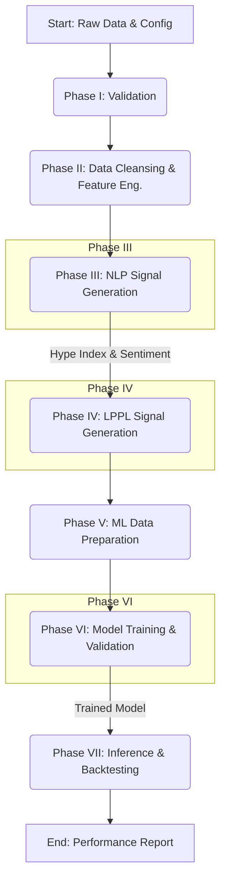

# `README.md`

# Identifying and Quantifying Financial Bubbles with the Hyped Log-Periodic Power Law Model

<!-- PROJECT SHIELDS -->
[](https://opensource.org/licenses/MIT)
[](https://www.python.org/)
[](https://arxiv.org/abs/2510.10878)
[](https://github.com/chirindaopensource/identifying_quantifying_financial_bubbles_hyped_log_period_power_law)
[](https://github.com/chirindaopensource/identifying_quantifying_financial_bubbles_hyped_log_period_power_law)
[](https://github.com/chirindaopensource/identifying_quantifying_financial_bubbles_hyped_log_period_power_law)
[](https://github.com/chirindaopensource/identifying_quantifying_financial_bubbles_hyped_log_period_power_law)
[](https://github.com/chirindaopensource/identifying_quantifying_financial_bubbles_hyped_log_period_power_law)
[](https://github.com/chirindaopensource/identifying_quantifying_financial_bubbles_hyped_log_period_power_law)
[](https://github.com/psf/black)
[](http://mypy-lang.org/)
[](https://numpy.org/)
[](https://pandas.pydata.org/)
[](https://pytorch.org/)
[](https://scipy.org/)
[](https://huggingface.co/)
[](https://jupyter.org/)
[](https://yaml.org/)
---

**Repository:** `https://github.com/chirindaopensource/identifying_quantifying_financial_bubbles_hyped_log_period_power_law`

**Owner:** 2025 Craig Chirinda (Open Source Projects)

This repository contains an **independent**, professional-grade Python implementation of the research methodology from the 2025 paper entitled **"Identifying and Quantifying Financial Bubbles with the Hyped Log-Periodic Power Law Model"** by:

*   Zheng Cao
*   Xingran Shao
*   Yuheng Yan
*   Helyette Geman

The project provides a complete, end-to-end computational framework for replicating the paper's findings. It delivers a modular, auditable, and extensible pipeline that executes the entire research workflow: from rigorous data validation and NLP feature engineering to LPPL model fitting, deep learning, and backtesting.

## Table of Contents

- [Introduction](#introduction)
- [Theoretical Background](#theoretical-background)
- [Features](#features)
- [Methodology Implemented](#methodology-implemented)
- [Core Components (Notebook Structure)](#core-components-notebook-structure)
- [Key Callable: `execute_full_study`](#key-callable-execute_full_study)
- [Workflow Diagram](#workflow-diagram)
- [Prerequisites](#prerequisites)
- [Installation](#installation)
- [Input Data Structure](#input-data-structure)
- [Usage](#usage)
- [Output Structure](#output-structure)
- [Project Structure](#project-structure)
- [Customization](#customization)
- [Contributing](#contributing)
- [Recommended Extensions](#recommended-extensions)
- [License](#license)
- [Citation](#citation)
- [Acknowledgments](#acknowledgments)

## Introduction

This project provides a Python implementation of the methodologies presented in the 2025 paper "Identifying and Quantifying Financial Bubbles with the Hyped Log-Periodic Power Law Model." The core of this repository is the iPython Notebook `identifying_quantifying_financial_bubbles_hyped_log_period_power_law_draft.ipynb`, which contains a comprehensive suite of functions to replicate the paper's findings, from initial data validation to the final generation of all analytical tables and figures.

The paper proposes a novel framework (HLPPL) that fuses three distinct domains—econophysics, natural language processing, and deep learning—to create a superior, real-time indicator of financial asset mispricing. This codebase operationalizes that framework, allowing users to:
-   Rigorously validate and manage the entire experimental configuration via a `config.yaml` file.
-   Process raw market data and news text through a multi-stage feature engineering pipeline.
-   Fit the Log-Periodic Power Law (LPPL) model at scale using a robust, multi-start optimization strategy.
-   Construct the novel `BubbleScore` by fusing technical and behavioral signals.
-   Train a state-of-the-art Dual-Stream Transformer model to forecast the `BubbleScore`.
-   Run a complete, event-driven backtest to evaluate the trading performance of the generated signals.
-   Automatically conduct ablation and sensitivity studies to validate the model's robustness.

## Theoretical Background

The implemented methods are grounded in econophysics, behavioral finance, and deep learning.

**1. Log-Periodic Power Law (LPPL) Model:**
Originating from the physics of critical phenomena, the LPPL model describes the super-exponential growth of an asset price leading up to a crash (a critical point). The implementation fits the 7-parameter model defined in Equation (1):
$$
\ln p(t) = A + B(t_c - t)^m + C(t_c - t)^m \cos(\omega \ln(t_c - t) + \phi)
$$
The normalized residual from this fit, $\epsilon_{\text{norm}}(t)$, serves as the primary technical indicator of deviation from the theoretical bubble path.

**2. Behavioral Finance Signals (NLP):**
Two NLP-derived features are constructed to capture market psychology:
-   **Hype Index ($H_{i,t}$):** The share of media attention a stock receives on a given day, measuring intensity. (Equation 11)
-   **Sentiment Score ($S_{i,t}$):** The confidence-weighted average sentiment (positive, neutral, negative) of news articles, measuring tone. (Equation 9)

**3. Hyped LPPL (HLPPL) `BubbleScore`:**
The paper's core innovation is the fusion of the technical and behavioral signals into a single `BubbleScore`. The formula is regime-dependent, with the Hype Index acting as an amplifier in both positive and negative deviations. (Equation 14)
$$
\text{BubbleScore}_{i}(t) =
\begin{cases}
\epsilon_{\text{norm}}(t) + \alpha_1 H_{i,t} + \alpha_2 S_{i,t}, & \text{if } \epsilon_{\text{norm}}(t) > 0 \\
\epsilon_{\text{norm}}(t) - \alpha_1 H_{i,t} + \alpha_2 S_{i,t}, & \text{if } \epsilon_{\text{norm}}(t) \le 0
\end{cases}
$$

**4. Dual-Stream Transformer:**
A deep learning model is trained to forecast the `BubbleScore`. Its architecture is designed to process stock-specific features and market-wide features in parallel, allowing them to interact via a bi-directional cross-attention mechanism before making a final prediction.

## Features

The provided iPython Notebook (`identifying_quantifying_financial_bubbles_hyped_log_period_power_law_draft.ipynb`) implements the full research pipeline, including:

-   **Modular, Multi-Task Architecture:** The entire pipeline is broken down into 33 distinct, modular tasks, each with its own orchestrator function for maximum clarity and testability.
-   **Configuration-Driven Design:** All study parameters are managed in an external `config.yaml` file, allowing for easy customization and replication.
-   **Idempotent & Resumable Pipeline:** Computationally expensive steps (e.g., NLP processing, LPPL fitting, model training) create checkpoint files, allowing the pipeline to be resumed efficiently.
-   **Robust LPPL Fitting:** Implements a multi-start, constrained non-linear least squares optimization to robustly fit the 7-parameter LPPL model across thousands of rolling windows.
-   **State-of-the-Art Deep Learning:** Implements a Dual-Stream Transformer in PyTorch with modern training techniques (`AdamW`, `OneCycleLR`, gradient clipping, early stopping) and a custom multi-component loss function.
-   **Realistic Event-Driven Backtester:** Simulates trading performance with daily stop-loss checks and transaction costs.
-   **Automated Ablation & Sensitivity Analysis:** Includes a top-level orchestrator to automatically re-run the entire pipeline under different configurations to test the contribution of each model component.

## Methodology Implemented

The notebook is a direct, sequential implementation of the paper's methodology:

1.  **Validation & Cleansing (Tasks 1-6):** Ingests and validates the `config.yaml` and raw data, cleanses the data, adjusts for corporate actions, and engineers primary features.
2.  **NLP Feature Engineering (Tasks 7-12):** Uses BERTopic and FinBERT to process news text and generate the `Sentiment_Score` and `Hype_Index`.
3.  **LPPL Signal Generation (Tasks 13-18):** Defines rolling windows, fits the LPPL model, computes normalized residuals, fuses them into the `BubbleScore`, and labels discrete episodes.
4.  **ML Data Preparation (Tasks 19-22):** Normalizes features (with leakage protection), constructs fixed-length sequences for the stock and market streams, creates multi-horizon targets, and performs a strict chronological split.
5.  **Deep Learning (Tasks 23-28):** Defines the `DualStreamTransformer` architecture and `CompositeLoss`, trains the model with early stopping, persists the final artifact, and evaluates its out-of-sample predictive performance.
6.  **Backtesting (Tasks 29-31):** Converts predictions into discrete trading signals, runs the event-driven backtest, and computes a full suite of performance metrics.
7.  **Final Orchestration (Tasks 32-33):** Provides top-level functions to run the entire baseline pipeline and the full suite of ablation studies.

## Core Components (Notebook Structure)

The `identifying_quantifying_financial_bubbles_hyped_log_period_power_law_draft.ipynb` notebook is structured as a logical pipeline with modular orchestrator functions for each of the 33 major tasks. All functions are self-contained, fully documented with type hints and docstrings, and designed for professional-grade execution.

## Key Callable: `execute_full_study`

The project is designed around a single, top-level user-facing interface function:

-   **`execute_full_study`:** This master orchestrator function, located in the final section of the notebook, runs the entire automated research pipeline from end-to-end. A single call to this function reproduces the entire computational portion of the project, from data validation to the final report.

## Workflow Diagram

The following diagram illustrates the high-level workflow orchestrated by the `run_hlppl_pipeline` function, which is the core engine called by `execute_full_study`.



## Prerequisites

-   Python 3.9+
-   A CUDA-enabled GPU is highly recommended for the deep learning and NLP components.
-   Core dependencies: `pandas`, `numpy`, `torch`, `transformers`, `sentence-transformers`, `bertopic`, `umap-learn`, `hdbscan`, `scipy`, `pyyaml`, `matplotlib`, `seaborn`, `tqdm`.

## Installation

1.  **Clone the repository:**
    ```sh
    git clone https://github.com/chirindaopensource/identifying_quantifying_financial_bubbles_hyped_log_period_power_law.git
    cd identifying_quantifying_financial_bubbles_hyped_log_period_power_law
    ```

2.  **Create and activate a virtual environment (recommended):**
    ```sh
    python -m venv venv
    source venv/bin/activate  # On Windows, use `venv\Scripts\activate`
    ```

3.  **Install Python dependencies:**
    ```sh
    pip install -r requirements.txt
    ```

## Input Data Structure

The pipeline requires a `pandas.DataFrame` (`df_raw`) with a `MultiIndex` of `('Date', 'TICKER')` and the following columns and dtypes:
-   `PERMNO`: `int64`
-   `SIC_Code`: `int64`
-   `Close_Price_Raw`: `float64`
-   `Volume_Raw`: `int64`
-   `CFACSHR`: `float64`
-   `PE_Ratio`: `float64`
-   `PB_Ratio`: `float64`
-   `VIX_Close`: `float64`
-   `News_Articles`: `object` (containing `list` of `str`)

All other parameters are controlled by the `config.yaml` file.

## Usage

The `identifying_quantifying_financial_bubbles_hyped_log_period_power_law_draft.ipynb` notebook provides a complete, step-by-step guide. The primary workflow is to execute the final cell of the notebook, which contains the main execution block:

```python
# Final cell of the notebook

# This function generates a sample DataFrame for demonstration.
# In a real run, you would load your own data here.
df_raw = create_sample_dataframe()

# Load the master configuration from the YAML file.
with open("config.yaml", 'r') as f:
    base_config = yaml.safe_load(f)

# --- Execute the entire study ---
# To run only the baseline model (faster):
final_results = execute_full_study(
    df_raw=df_raw,
    base_config=base_config,
    run_ablation=False
)

# To run the baseline AND all ablation/sensitivity studies (very slow):
# final_results = execute_full_study(
#     df_raw=df_raw,
#     base_config=base_config,
#     run_ablation=True
# )

# The `final_results` dictionary will contain the key outputs.
print(final_results['baseline_performance'])
```

## Output Structure

The `execute_full_study` function creates a `study_results/` directory with the following structure:

```
study_results/
│
├── baseline/
│   ├── data_intermediate/
│   ├── logs/
│   ├── models/
│   └── reports/
│       └── performance_summary.csv
│
└── ablation_studies/
    ├── ablation_no_hype/
    │   ├── data_intermediate/
    │   ├── logs/
    │   ├── models/
    │   └── reports/
    ├── ... (other experiments)
    │
    ├── ablation_comparison_summary.csv
    └── ablation_core_performance.png
```

## Project Structure

```
identifying_quantifying_financial_bubbles_hyped_log_period_power_law/
│
├── identifying_quantifying_financial_bubbles_hyped_log_period_power_law_draft.ipynb # Main implementation notebook
├── config.yaml                                                                      # Master configuration file
├── requirements.txt                                                                 # Python package dependencies
├── LICENSE                                                                          # MIT license file
└── README.md                                                                        # This documentation file
```

## Customization

The pipeline is highly customizable via the `config.yaml` file. Users can easily modify all study parameters, including LPPL window size, `BubbleScore` weights, Transformer architecture, and backtesting thresholds, without altering the core Python code.

## Contributing

Contributions are welcome. Please fork the repository, create a feature branch, and submit a pull request with a clear description of your changes. Adherence to PEP 8, type hinting, and comprehensive docstrings is required.

## Recommended Extensions

Future extensions could include:
-   **Alternative Architectures:** Replacing the Transformer with other sequence models like LSTMs or state-space models (e.g., Mamba).
-   **Dynamic Alpha Weights:** Making the `alpha_1` and `alpha_2` weights in the `BubbleScore` dynamic, perhaps dependent on market volatility.
-   **Advanced Backtesting:** Integrating a more sophisticated backtesting engine that handles portfolio-level constraints, realistic order execution, and market impact.
-   **Cross-Asset Analysis:** Applying the HLPPL framework to other asset classes like cryptocurrencies, commodities, or fixed income.

## License

This project is licensed under the MIT License.

## Citation

If you use this code or the methodology in your research, please cite the original paper:

```bibtex
@article{cao2025identifying,
  title   = {Identifying and Quantifying Financial Bubbles with the Hyped Log-Periodic Power Law Model},
  author  = {Cao, Zheng and Shao, Xingran and Yan, Yuheng and Geman, Helyette},
  journal = {arXiv preprint arXiv:2510.10878},
  year    = {2025}
}
```

For the implementation itself, you may cite this repository:
```
Chirinda, C. (2025). A Professional-Grade Implementation of the "Hyped Log-Periodic Power Law Model" Framework.
GitHub repository: https://github.com/chirindaopensource/identifying_quantifying_financial_bubbles_hyped_log_period_power_law
```

## Acknowledgments

-   Credit to **Zheng Cao, Xingran Shao, Yuheng Yan, and Helyette Geman** for the foundational research that forms the entire basis for this computational replication.
-   This project is built upon the exceptional tools provided by the open-source community. Sincere thanks to the developers of the scientific Python ecosystem, including **Pandas, NumPy, Scikit-learn, PyTorch, Hugging Face, SciPy, and Jupyter**.

--

*This README was generated based on the structure and content of the `identifying_quantifying_financial_bubbles_hyped_log_period_power_law_draft.ipynb` notebook and follows best practices for research software documentation.*
